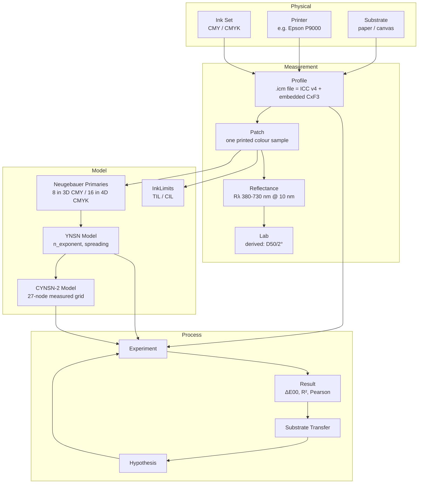
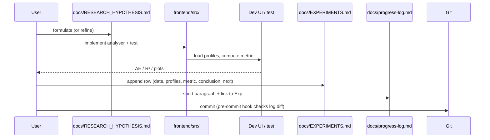

# ONTOLOGY.md — Domain Model

> Single source of truth for vocabulary used across `docs/`, `frontend/src/`, commit messages,
> and experiment logs. If you find a term in the code that is not here, add it here first.

---

## 1. Top-level diagram



---

## 2. Entities

### 2.1 Substrate
The physical printable surface (paper, canvas, film). Identified in this project by the
`substrate` field parsed from the filename (e.g. `CanvasMatte`, `WCRW`, `VibranceLuster`).

### 2.2 Printer
Print engine and configuration. Constant across the current dataset (`Epson P9000`). Encoded
in filename as `P9000`.

### 2.3 Ink Set
Colorant set used by the printer. Currently CMY (K modeled as 0 in 3D CYNSN). The codebase
must remain agnostic via `DeviceSpace = 'rgb' | 'cmyk'` — see §3.1.

### 2.4 Profile
An `.icm` file = ICC v4 RGB header + tag table + embedded CxF3 spectral data in a private
`ZXML` tag. Parsed by `iccTagScanner.extractZxmlCxfXml` (pako-inflated, skip 12 bytes) →
`cxfParser.parseCxf3Xml`. **Invariants:**
- ICC tag count at byte 128 (not 132).
- ZXML tag signature `'CxF '`, data-type bytes `'ZXML'`.
- Tag table entries start at byte 132.
- All 27 P9000 ICMs are **RGB** profiles.
- 24 contain M0 measurements; 4 contain M2 (UV-cut); 2 are larger (AllureAq, 1550 patches × 2 pages).

### 2.5 Patch
A single printed colour sample. Identified by `Row:Col:Page` (the cross-profile join key).
Stored as `Measurement` in `types/index.ts`.

| Field | Meaning |
|---|---|
| `SAMPLE_ID` | `R{row}C{col}P{page}` — stable across profiles for matching |
| `device` | `{ space: 'rgb' \| 'cmyk', values: number[] }` (after DeviceSpace refactor) |
| `RGB_R/G/B` | 0–255 — legacy fields, kept until DeviceSpace migration completes |
| `CMYK_C/M/Y/K` | 0–100 — legacy, used by old `linearityAnalyzer` |
| `LAB_L/A/B` | Computed from spectra via D50/2° |
| `spectra` | 36 values, reflectance 0–1, 380–730 nm @ 10 nm |
| `wavelengths` | `[380, 390, …, 730]` |
| `deltaE00` | Optional: CIEDE2000 vs reference patch |
| `is_outlier` | Optional: set by future MAD outlier detector |

### 2.6 Reflectance R(λ) — *primary measurement*
36-band spectral reflectance, 380–730 nm, 10 nm step. Stored as `number[]` of length 36 in
`Measurement.spectra`. Convention: 0 = perfect absorber, 1 = perfect diffuse reflector.

**This is the source of truth.** All hypothesis testing rests on spectra (or XYZ-linear
projections of spectra). Lab and ΔE00 are reported for human readability only — never
as the basis for a falsification decision.

### 2.7 Lab — *derived, informational*
CIE L\*a\*b\* under D50 illuminant, 2° observer. Derived from `R(λ)` via
`spectraToXYZ(reflectance, startWL) → xyzToLab(X, Y, Z)` in `lib/colormath.ts`. CxF files
may also carry Lab directly; the project prefers the recomputed value to keep the pipeline
consistent. Two Lab values for the same patch (CxF-stored vs recomputed) typically agree
to within 0.5 ΔE76, but small disagreement is expected and not a bug.

### 2.8 Neugebauer Primary
A corner of the device-colorant cube. 3D CMY → 8 primaries (paper, C, M, Y, R=MY, G=CY,
B=CM, K=CMY). 4D CMYK → 16 primaries. Extracted from measured patches by
`extractNeugebauerPrimaries3` via inverse-distance-weighted KNN (tolerance 0.10) on the
CMY cube vertices.

### 2.9 YNSN Model
Yule-Nielsen Spectral Neugebauer. Forward formula:
$$R(\lambda) = \left( \sum_v w_v \cdot R_v(\lambda)^{1/n} \right)^n$$
where $w_v$ are the Demichel weights and $R_v(\lambda)$ are the primary spectra. Parameter
space: `(spreading[3], n_exponent)` → 4 reals optimised by Nelder-Mead on mean ΔE00 loss.

### 2.10 CYNSN-2 Model
Cellular Yule-Nielsen with one subdivision of the colorant cube → 27 nodes (3×3×3 in CMY).
Nodes near measured patches (tolerance 0.08) are overridden with measured spectra. The
remaining nodes are filled by YNSN-style primary formula. See `docs/cynsn-pipeline.md` for
the full flow and known bugs.

### 2.11 InkLimits
Per-channel maximum ink load before ΔE departs from the YN-predicted ramp. Computed by
`limitsAnalyzer.computeRampErrors` using `n=2` Yule-Nielsen interpolation between paper and
primary. Threshold: ΔE76 > 6. Includes single-channel limits (C, M, Y) and 2-ink combo
limits (CY, MY, CM).

### 2.12 Hypothesis
A falsifiable statement about device-substrate separation. Lives in
`docs/RESEARCH_HYPOTHESIS.md`. Must specify:
- A measurable quantity (e.g. "Pearson r of T(λ) between ref and target").
- A target threshold and a falsification threshold.
- A pre-registered dataset slice.

### 2.13 Experiment
One run that tests a hypothesis on real data. Each row in `docs/EXPERIMENTS.md` is an
experiment. **Required fields:** date, profiles used, commit SHA (so the analyser version
is pinned), metric value, conclusion, next step.

### 2.14 Substrate Transfer
The end goal: a low-parameter mapping that takes the CYNSN model fit on substrate A and
predicts the model on substrate B from ≤ 12 measured patches on B.

---

## 3. Cross-cutting concepts

### 3.1 DeviceSpace discriminator

The codebase currently mixes legacy CMYK fields with RGB-only data. The migration target:

```ts
type DeviceSpace = 'rgb' | 'cmyk';

interface DeviceValue {
  space: DeviceSpace;
  values: number[]; // RGB: [r, g, b] in 0–255; CMYK: [c, m, y, k] in 0–100
}

interface Measurement {
  SAMPLE_ID: string;
  device: DeviceValue;
  LAB_L: number; LAB_A: number; LAB_B: number;
  spectra?: number[];
  wavelengths?: number[];
  // ... derived fields
}
```

All analysers branch on `device.space`. Helpers `toCMY(device): [c,m,y]` and
`toCMYK(device): [c,m,y,k]` provide the projection into the modeling cube.

### 3.2 Coordinate system invariants

| Quantity | Unit / range | Convention |
|---|---|---|
| Reflectance | 0–1 | Linear (not log) |
| Wavelength | nm | 380–730 inclusive, step 10 |
| Device RGB | 0–255 (int) | sRGB **device** (not encoded) — see §3.3 |
| Device CMYK | 0–100 (%) | nominal coverage, not effective dot |
| Lab | L: 0–100, a/b: ±128 | D50 / 2° |
| XYZ | Y normalised to 100 | D50 white point |
| ΔE | ΔE00 (CIEDE2000) | preferred; ΔE76 only inside `limitsAnalyzer` ramps |

### 3.3 Important distinction: device vs colorimetric

RGB values in `Measurement.RGB_R/G/B` are **device addressing values** for the printer
(0 = max ink, 255 = no ink), **not** sRGB display values. Conversion to modeling space:

```
C = (255 - R) / 255   ∈ [0, 1]
M = (255 - G) / 255   ∈ [0, 1]
Y = (255 - B) / 255   ∈ [0, 1]
```

This is the only correct way to feed RGB profiles into the 3D CMY model. Skipping the
inversion is the most common bug in new code reading the dataset.

---

## 4. Lifecycle of an experiment (DDD)



---

## 5. Glossary

| Term | Definition |
|---|---|
| **A2B** | ICC tag mapping device colorant → PCS (XYZ or Lab). Not currently used; we go through CxF spectra instead. |
| **CGATS.17** | ASCII tabular exchange format for measurement data. Exporter in `lib/cgatsExport.ts`. |
| **CIEDE2000** | Modern perceptual ΔE formula. ISO 11664-6. Implemented in `colormath.ts:deltaE00`. |
| **CxF / CxF3 / CxF4** | Color eXchange Format (ISO 17972). CxF3 is the M0 spectral characterisation; CxF4 is spot colour. We parse CxF3 only. |
| **Demichel** | Weighting scheme for Neugebauer primaries; `w_v = Π c_i^{c_i} · (1-c_i)^{(1-c_i)}` per axis. |
| **MAD** | Median Absolute Deviation — robust outlier detector. Planned for the cleaning pipeline. |
| **Savitzky-Golay** | Local polynomial smoothing filter for spectra. Planned. |
| **TIL / CIL** | Total Ink Limit / Channel Ink Limit. |
| **YN (Yule-Nielsen)** | Optical model for paper/ink reflectance: $R = ((1-t) R_p^{1/n} + t R_i^{1/n})^n$. |
| **ZXML** | zlib-compressed XML. Used by X-Rite to embed CxF3 inside ICC profiles. |
