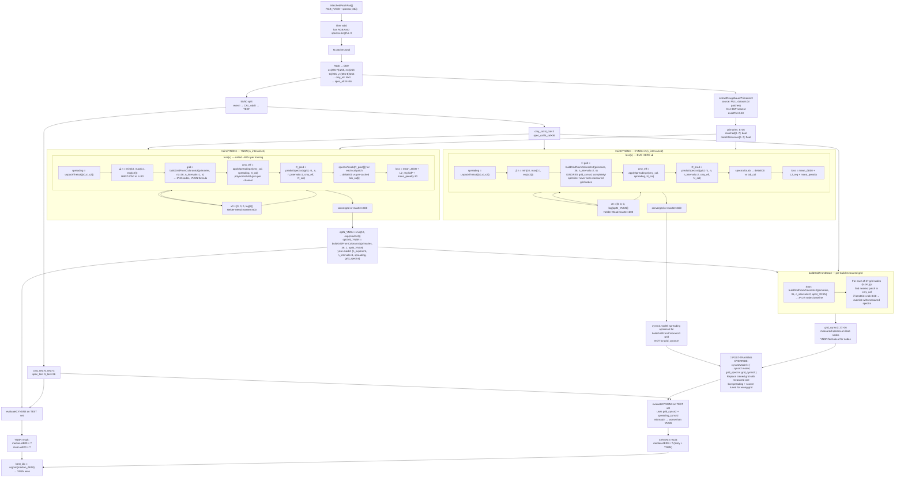

# CYNSN Pipeline — Detailed Mermaid Diagram

Diagrams the full `runCYNSNComparison` flow in `frontend/src/lib/analyzers/cynsn.ts`.
Identifies two bugs: `n=10` hard cap and CYNSN-2 grid mismatch.

## Bugs Found

### Bug 1 — n=10 hard cap
`loss()` applies `Math.min(10, Math.exp(x[3]))`. If optimal n > 10 (some substrates need n=15–20),
the optimizer hits the boundary and stalls: gradient ≈ 0, result stuck at n=10.

**Fix:** raise cap to 30, or use uncapped `Math.exp(x[3])` with a soft penalty for very large n.

### Bug 2 — CYNSN-2 grid/spreading mismatch (primary bug)
`trainCYNSN3` for CYNSN-2 calls `buildGridFromColorants3` inside `loss()` — never sees `grid_cynsn2`.
Optimizer tunes `spreading` and `n` for the colorant-formula grid, then the grid is swapped to the
measured one post-training. Spreading parameters are incompatible with the substituted grid.

**Fix:** pass `grid_cynsn2` into `trainCYNSN3` and use it directly inside `loss()`.
Only `spreading` (and optionally `n`) should remain free parameters for CYNSN-2;
the grid itself is fixed from measurements.
